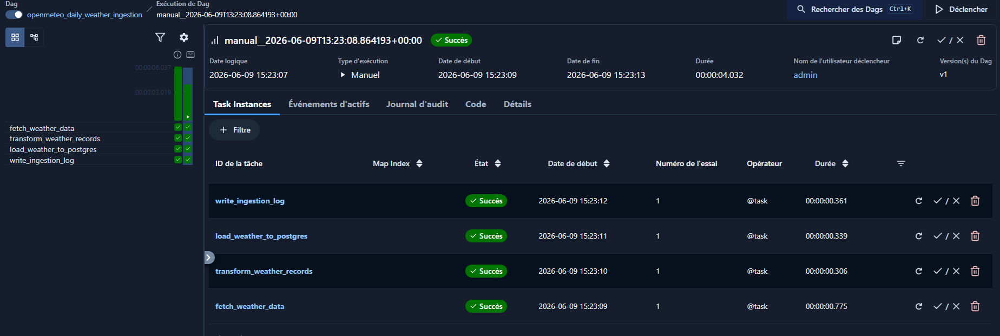
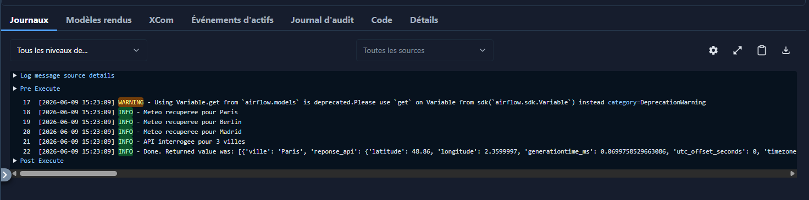
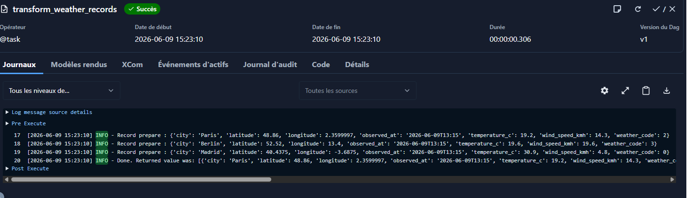
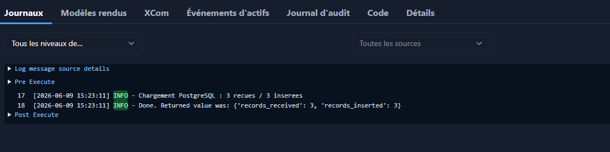
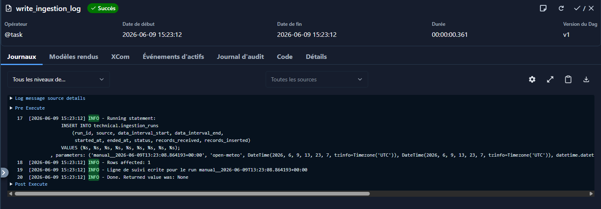

# Pipeline météo Open-Meteo → PostgreSQL (TP 2B)

DAG Airflow qui récupère la météo de plusieurs villes via Open-Meteo, la transforme, la charge dans PostgreSQL et garde une trace de chaque exécution.

Le DAG s'appelle `openmeteo_daily_weather_ingestion` (source + fréquence + périmètre + type, comme vu en cours sur le nommage).

## Ce que j'ai utilisé
- Airflow 3.2.2 (`@dag` / `@task`)
- Python 3.14
- PostgreSQL (en local sous WSL)
- API Open-Meteo (gratuite, sans clé)

## Les 4 tâches

```
fetch_weather_data
  >> transform_weather_records
  >> load_weather_to_postgres
  >> write_ingestion_log
```

- **fetch_weather_data** : appelle l'API pour chaque ville et renvoie les réponses brutes. Rien d'autre.
- **transform_weather_records** : aplatit la réponse JSON en lignes propres (1 ligne / ville), en ne gardant que les champs utiles.
- **load_weather_to_postgres** : insère dans `silver.weather_observations`. J'utilise un upsert (`ON CONFLICT`) pour pouvoir relancer le DAG sans créer de doublons.
- **write_ingestion_log** : écrit une ligne dans `technical.ingestion_runs` (run_id, dates, statut, nb de lignes reçues/insérées).

J'ai gardé une tâche par étape pour pouvoir voir dans l'UI où ça casse et relancer juste la partie qui a échoué (par ex. si la base est down mais que l'API a répondu).

## Les tables (script `schema.sql`)

- `silver.weather_observations` : la donnée métier, une observation par ville/horodatage. Unicité sur (city, observed_at).
- `technical.ingestion_runs` : le suivi des exécutions, une ligne par run.

J'ai séparé en deux schémas exprès : le métier d'un côté, la traçabilité technique de l'autre.

## Le paramétrage (pas de hardcode)

- **Villes** = paramètre métier → lu dans la Variable Airflow `weather_cities` (sinon liste par défaut Paris / Berlin / Madrid).
- **Accès PostgreSQL** = paramètre technique → via une Connexion Airflow (`weather_postgres`), donc pas de mot de passe écrit dans le code.

---

# Installation et exécution (depuis zéro)

> Airflow tourne sous Linux / macOS / WSL. Sous Windows, faire tout ce qui suit dans un terminal **Ubuntu (WSL)**.

### 1. Récupérer le projet
```bash
git clone <url-du-repo>
cd <dossier-du-repo>
```

### 2. Environnement Python + Airflow
```bash
python3 -m venv venv
source venv/bin/activate
export AIRFLOW_HOME=~/airflow-tp

AIRFLOW_VERSION=3.2.2
PYTHON_VERSION="$(python -c 'import sys; print(f"{sys.version_info.major}.{sys.version_info.minor}")')"
CONSTRAINT_URL="https://raw.githubusercontent.com/apache/airflow/constraints-${AIRFLOW_VERSION}/constraints-${PYTHON_VERSION}.txt"
pip install "apache-airflow==${AIRFLOW_VERSION}" --constraint "${CONSTRAINT_URL}"
pip install apache-airflow-providers-postgres
```

### 3. PostgreSQL : installer, démarrer, créer la base
```bash
sudo apt update && sudo apt install -y postgresql postgresql-contrib
sudo service postgresql start

sudo -u postgres psql -c "CREATE USER weather_user WITH PASSWORD 'weather_pass';"
sudo -u postgres psql -c "CREATE DATABASE weather_db OWNER weather_user;"
```

### 4. Créer les tables avec le script SQL
```bash
PGPASSWORD=weather_pass psql -h localhost -U weather_user -d weather_db -f schema.sql
```

### 5. Déclarer la connexion PostgreSQL dans Airflow
Le nom `weather_postgres` doit correspondre à celui attendu par le DAG.
```bash
airflow connections add weather_postgres \
  --conn-type postgres \
  --conn-host localhost \
  --conn-login weather_user \
  --conn-password weather_pass \
  --conn-schema weather_db \
  --conn-port 5432
```

### 6. (Optionnel) Personnaliser les villes
Sans rien faire, le DAG utilise Paris / Berlin / Madrid. Pour changer :
```bash
airflow variables set weather_cities '[{"nom":"Lyon","latitude":45.75,"longitude":4.85},{"nom":"Rome","latitude":41.9,"longitude":12.5}]'
```

### 7. Mettre le DAG dans le dossier `dags/` et lancer Airflow
```bash
mkdir -p "$AIRFLOW_HOME/dags"
cp openmeteo_daily_weather_ingestion.py "$AIRFLOW_HOME/dags/"
airflow standalone
```
Ouvrir http://localhost:8080 (login `admin`, mot de passe affiché au démarrage ou dans
`$AIRFLOW_HOME/simple_auth_manager_passwords.json.generated`), activer le DAG
`openmeteo_daily_weather_ingestion`, puis cliquer sur **Déclencher**.

### 8. Vérifier le chargement
```bash
PGPASSWORD=weather_pass psql -h localhost -U weather_user -d weather_db \
  -c "SELECT city, observed_at, temperature_c, wind_speed_kmh FROM silver.weather_observations;"

PGPASSWORD=weather_pass psql -h localhost -U weather_user -d weather_db \
  -c "SELECT run_id, source, status, records_received, records_inserted FROM technical.ingestion_runs;"
```

> Le DAG est idempotent : on peut le relancer plusieurs fois sans créer de doublons
> (upsert sur `(city, observed_at)`), une nouvelle ligne de suivi est ajoutée à chaque run.

---

## Preuve de chargement

Les 4 tâches en succès :



Contenu des logs pour chaque taches :




Ligne de suivi dans la table d'ingestion :


